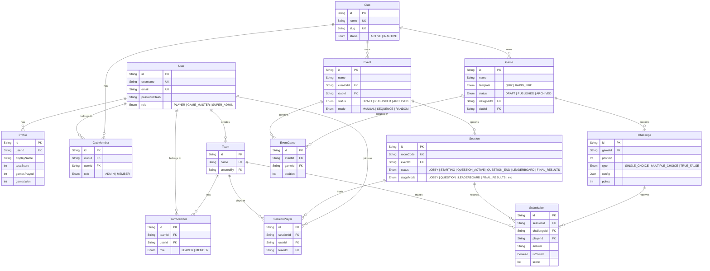

# TERMINAL — Backend, Database Schema, and API

## 1. Database Schema [IMPLEMENTED]

The database uses PostgreSQL managed by Prisma. Below is the conceptual Entity-Relationship (ER) mapping of the current schema (`prisma/schema.prisma`):

## 2. API Endpoints [IMPLEMENTED]

The backend provides a RESTful API powered by Express.

### Authentication (`/api/auth`)
- `POST /register`: Register a new user.
- `POST /login`: Authenticate and receive a JWT.
- `GET /me`: Get current authenticated user details.

### Clubs (`/api/clubs`)
- `GET /`: List clubs the user belongs to.
- `GET /:clubId`: Get specific club details.
- `POST /`: Create a new club (Requires Super Admin).

### Events (`/api/events`)
- `POST /`: Create an event.
- `GET /`: List events (filtered by `clubId`).
- `GET /:id`: Get specific event details.
- `PUT /:id`: Update event.
- `POST /:id/games`: Add a game to an event.
- `PUT /:id/games/reorder`: Reorder games within an event.
- `DELETE /:id/games/:gameId`: Remove a game from an event.

### Games (`/api/games`)
- `GET /`: List games (filtered by `clubId`).
- `POST /`: Create a game.
- `GET /:id`: Get specific game with challenges.
- `DELETE /:id`: Delete a game.
- `POST /:id/publish`: Change game status to PUBLISHED.
- `POST /:id/challenges`: Add a challenge to a game.
- `POST /:id/challenges/reorder`: Reorder challenges.
- `DELETE /:id/challenges/:challengeId`: Remove a challenge.

### Sessions (`/api/sessions`)
- `POST /`: Spawn a live session from an event (returns room code).
- `POST /join`: Player joins a session via room code.
- `GET /:roomCode`: Get active session state.
- `PUT /:id/status`: Update session status/stage mode (Host only).
- `PUT /:id/advance`: Advance session to next game/challenge (Host only).
- `POST /active/submit`: Submit an answer to the current active challenge.
- `POST /:code/submit`: Legacy alias for submission.
