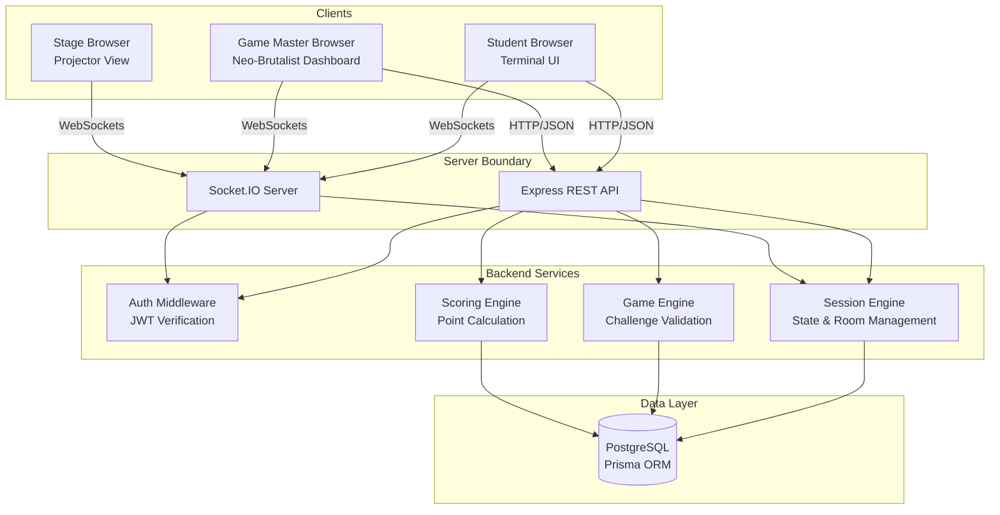

# TERMINAL — System Architecture

## 1. High-Level Architecture Diagram [IMPLEMENTED]

## 2. Real-Time Architecture (Socket.IO) [IMPLEMENTED]

Socket.IO handles state broadcasting and live synchronization.

### Event: `host:join`
- **Sender:** Game Master Client
- **Receiver:** Server
- **Purpose:** Associates the GM's socket with a specific session room and authenticates ownership.

### Event: `player:join`
- **Sender:** Student Client
- **Receiver:** Server
- **Purpose:** Associates the player's socket with a session room.
- **Server Action:** Broadcasts updated player list to the host and stage.

### Event: `stage:join`
- **Sender:** Stage Client
- **Receiver:** Server
- **Purpose:** Connects a public display to the session for read-only updates.

### Event: `host:change_status`
- **Sender:** Game Master Client
- **Receiver:** Server
- **Purpose:** Instructs the server to change the session's conceptual state (e.g., LOBBY to STARTING).
- **Server Action:** Updates DB, broadcasts `session_state_update` to all connected clients in the room.

### Event: `host:select_game` / `host:select_challenge`
- **Sender:** Game Master Client
- **Receiver:** Server
- **Purpose:** Forces the session to transition to a specific game or challenge index.
- **Server Action:** Updates DB, strips answers from the challenge payload, and broadcasts `session_state_update`.

### Event: `host:set_stage_mode`
- **Sender:** Game Master Client
- **Receiver:** Server
- **Purpose:** Overrides the Stage view explicitly (e.g., forcing it to show LEADERBOARD).
- **Server Action:** Updates DB, broadcasts to stage clients.

### Broadcast: `session_state_update`
- **Sender:** Server
- **Receiver:** All Clients (Players, Host, Stage)
- **Purpose:** The single source of truth for the live session. Contains current game, challenge (sanitized without correct answers), timers, and state strings.

## 3. Security Architecture [IMPLEMENTED]

- **Authentication:** JWTs are issued on login and passed via Bearer headers (API) or handshake auth payload (Sockets).
- **API Authorization:** Middleware checks `requireClubAdmin` or `requireSuperAdmin` by querying `ClubMember` join tables. Ensure users can only modify events/games they own or club resources they administrate.
- **Socket Authorization:** The server drops socket events from users claiming to be the "host" if their JWT user ID doesn't match the event's creator or club admin.
- **Server-Authoritative Scoring:** Clients submit answers (`POST /api/sessions/active/submit`). The server looks up the true answer in the DB, calculates time/score, saves the submission, and returns the points. Clients *never* dictate their own score.
- **Duplicate Prevention:** Prisma schema enforces a unique constraint `@@unique([sessionId, challengeId, playerId])` on the `Submission` table to prevent double-scoring race conditions.
