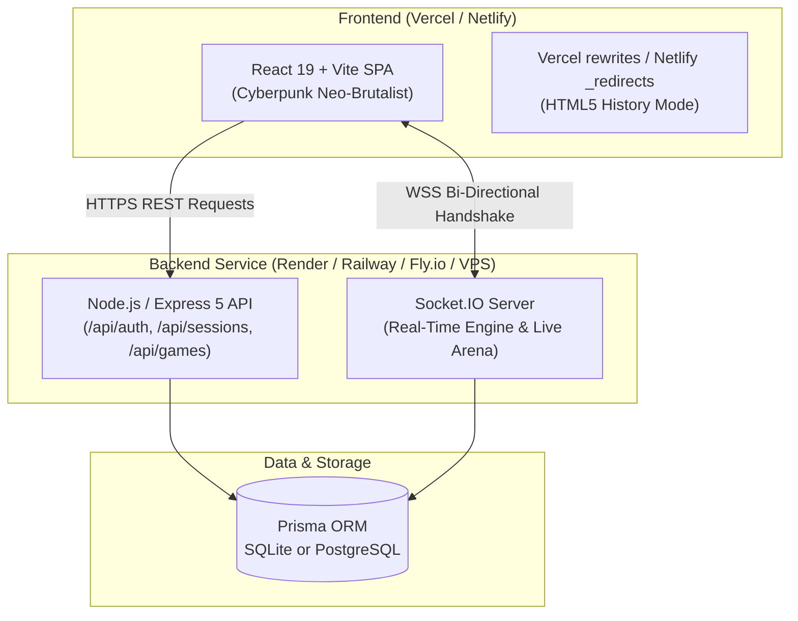

# TERMINAL — Production Deployment Guide
**Architecture:** Vercel / Netlify (Frontend SPA) + Dedicated Node.js / Socket.IO Service (Backend)

---

## 1. System Architecture Overview



---

## 2. Environment Variables Matrix

### A. Frontend Environment Variables (`client/.env`)
Set these in your **Vercel** or **Netlify** Project Settings:

| Variable | Required | Example Value | Description |
| :--- | :---: | :--- | :--- |
| `VITE_API_URL` | **Yes** | `https://api.yourterminal.com` or `https://terminal-server.onrender.com` | Full HTTPS URL of the deployed backend server (no trailing slash). |
| `VITE_SOCKET_URL` | Optional | `https://api.yourterminal.com` | Defaults automatically to `VITE_API_URL` if omitted. |

### B. Backend Environment Variables (`server/.env`)
Set these in your **Render**, **Railway**, **Fly.io**, or **Linux VPS** environment:

| Variable | Required | Example Value | Description |
| :--- | :---: | :--- | :--- |
| `PORT` | Auto / Yes | `3001` or `8080` (auto-provided by Render/Railway) | Port for the HTTP and Socket.IO server. |
| `NODE_ENV` | **Yes** | `production` | Enables production optimizations. |
| `DATABASE_URL` | **Yes** | `file:../prisma/dev.db` (or PostgreSQL connection string) | Connection string for Prisma. |
| `JWT_SECRET` | **Yes** | `super-secure-random-64-character-secret` | Secret key for signing operator & admin tokens. |
| `CLIENT_URL` | **Yes** | `https://terminal.vercel.app,https://yourcustomdomain.com` | Comma-separated list of allowed origins for CORS and Socket.IO. Automatically permits `*.vercel.app` and `*.netlify.app` previews. |
| `ADMIN_USERNAME` | Optional | `root` | Super Admin handle (defaults to `root`). |
| `ADMIN_PASSWORD` | Optional | `Root-Soumya` (or custom secure pass) | Super Admin password initialized on startup. |

---

## 3. Step 1: Deploy Backend Service (Node.js + WebSockets)

Because TERMINAL utilizes real-time WebSockets (`Socket.IO`), the backend must run on a persistent Node.js environment (such as **Render**, **Railway**, **Fly.io**, or an **Ubuntu VPS**).

### Option A: Deploying on Render.com (Web Service)
1. Go to [Render Dashboard](https://dashboard.render.com/) and click **New + Web Service**.
2. Connect your Git repository.
3. Configure the service settings:
   - **Name:** `terminal-api`
   - **Root Directory:** `server`
   - **Environment:** `Node`
   - **Build Command:** `npm install && npm run db:generate && npm run build`
   - **Start Command:** `npm start`
4. In **Environment Variables**, add:
   - `NODE_ENV` = `production`
   - `DATABASE_URL` = `file:../prisma/dev.db` (or attach a persistent disk / Postgres instance)
   - `JWT_SECRET` = *(generate a strong secret)*
   - `CLIENT_URL` = `https://your-frontend.vercel.app`
5. Click **Create Web Service**.
6. Copy your public service URL (e.g. `https://terminal-api.onrender.com`).

### Option B: Deploying on Railway.app
1. Create a **New Project** from your GitHub repo.
2. Under Settings:
   - **Root Directory:** `/server`
   - **Build Command:** `npm install && npm run db:generate && npm run build`
   - **Start Command:** `npm start`
3. Add Environment Variables (`DATABASE_URL`, `JWT_SECRET`, `CLIENT_URL`, `NODE_ENV`).
4. Generate a public domain under **Networking**.

---

## 4. Step 2: Deploy Frontend on Vercel or Netlify

### Deploying on Vercel
1. Go to [Vercel Dashboard](https://vercel.com/new) and import your Git repository.
2. In Project Settings:
   - **Framework Preset:** `Vite`
   - **Root Directory:** `client`
   - **Build Command:** `npm run build`
   - **Output Directory:** `dist`
3. Under **Environment Variables**, add:
   - `VITE_API_URL` = `https://terminal-api.onrender.com` (your backend URL)
4. Click **Deploy**.
5. *Note:* The included [`client/vercel.json`](file:///c:/Users/SOUMYA.B/Desktop/Terminal/client/vercel.json) automatically routes all SPA paths (`/terminal`, `/play/:code`, `/lobby/:code`, `/admin`) to `index.html`.

### Deploying on Netlify
1. Import repository on [Netlify](https://app.netlify.com/).
2. Set:
   - **Base directory:** `client`
   - **Build command:** `npm run build`
   - **Publish directory:** `dist`
3. Set environment variable: `VITE_API_URL` = your backend URL.
4. Click **Deploy Site**.
5. *Note:* The included [`client/public/_redirects`](file:///c:/Users/SOUMYA.B/Desktop/Terminal/client/public/_redirects) automatically ensures HTML5 pushState routing works without 404s.

---

## 5. Post-Deployment Verification Checklist

1. **Backend Health Check:**
   Visit `https://YOUR_BACKEND_URL/api/health`. Should return:
   ```json
   { "status": "ok", "timestamp": "2026-10-05T..." }
   ```
2. **CORS & WebSocket Check:**
   Open browser dev tools console on your Vercel URL. You should see no CORS errors and a successful Socket.IO handshake.
3. **Root Admin Login:**
   Navigate to `https://YOUR_FRONTEND_URL/login` and authenticate with:
   - **Operator ID:** `root`
   - **Password:** `Root-Soumya` (or your configured `ADMIN_PASSWORD`)
   - Confirm immediate redirect to `/admin` dashboard.
4. **Student Flow Check:**
   Open an incognito window, navigate to `/register`, create a student account, and verify the `/terminal` console loads with interactive commands (`help`, `whoami`, `team`, `battle`).
5. **Mobile Viewport Test:**
   Load the production URL on a smartphone or mobile devtools (375px/390px) to verify zero horizontal scrolling, responsive metric cards, and bottom-docked terminal telemetry.
